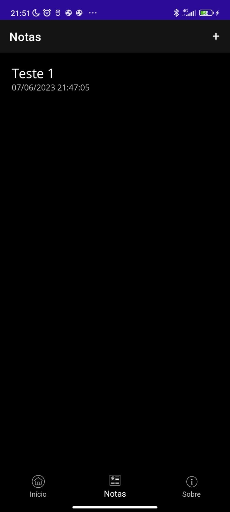
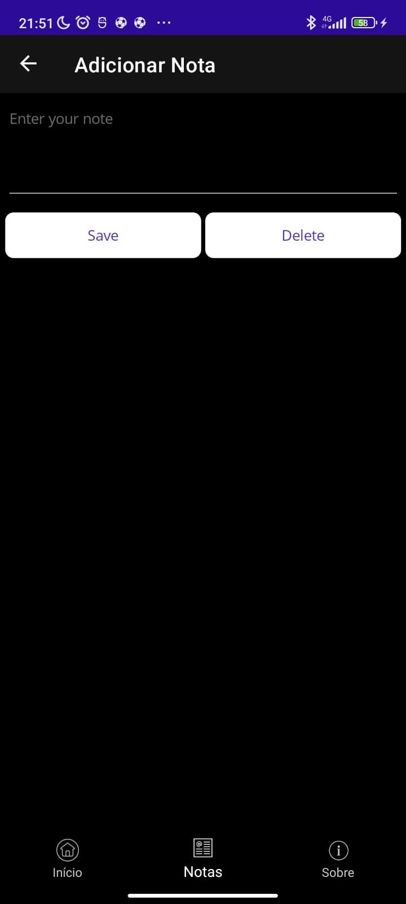

  <h1 align="center">

</h1>

<h1 align="center">Notes </h1>

Projeto de Notas feito em .NET MAUI na aula de Programação de Aplicativos Mobile I, onde aprendemos a utilizar Data e multi páginas.

## ⚙️ | Funcionamento

  

## ☕ | Linguagem utilizada

  <h3 align="left">.NET MAUI</h3>

## 🌎 | Links

[Você também pode fazer o seu próprio projeto clicando aqui](https://learn.microsoft.com/en-us/dotnet/maui/tutorials/notes-app/?tutorial-step=1)

<h4> Geovana Nascimento & Erika Santana</h4>

